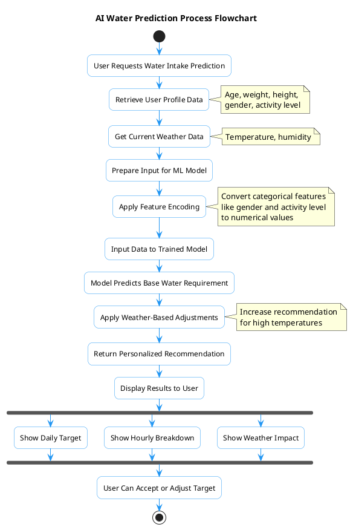

# Flowchart - AI Water Prediction Process

```plantuml
@startuml
skinparam backgroundColor white
skinparam roundCorner 15
skinparam ArrowColor #2196F3
skinparam ActivityBorderColor #2196F3
skinparam ActivityBackgroundColor white

title AI Water Prediction Process Flowchart

start

:User Requests Water Intake Prediction;

:Retrieve User Profile Data;
note right: Age, weight, height,\ngender, activity level

:Get Current Weather Data;
note right: Temperature, humidity

:Prepare Input for ML Model;

:Apply Feature Encoding;
note right: Convert categorical features\nlike gender and activity level\nto numerical values

:Input Data to Trained Model;

:Model Predicts Base Water Requirement;

:Apply Weather-Based Adjustments;
note right: Increase recommendation\nfor high temperatures

:Return Personalized Recommendation;

:Display Results to User;
fork
  :Show Daily Target;
fork again
  :Show Hourly Breakdown;
fork again
  :Show Weather Impact;
end fork

:User Can Accept or Adjust Target;

stop
@enduml
```
