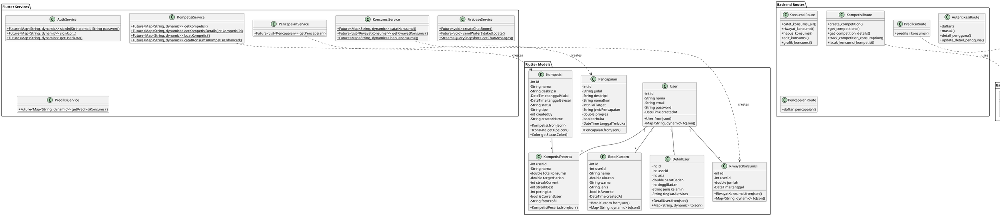

# Class Diagram (PlantUML)

```plantuml
@startuml
skinparam classAttributeIconSize 0

package "Flutter Models" {
  class User {
    -int id
    -String nama
    -String email
    -String password
    -DateTime createdAt
    +User.fromJson()
    +Map<String, dynamic> toJson()
  }

  class DetailUser {
    -int id
    -int userId
    -int usia
    -double beratBadan
    -int tinggiBadan
    -String jenisKelamin
    -String tingkatAktivitas
    +DetailUser.fromJson()
    +Map<String, dynamic> toJson()
  }

  class Kompetisi {
    -int id
    -String nama
    -String deskripsi
    -DateTime tanggalMulai
    -DateTime tanggalSelesai
    -String status
    -String tipe
    -int createdBy
    -String creatorName
    +Kompetisi.fromJson()
    +IconData getTipeIcon()
    +Color getStatusColor()
  }

  class KompetisiPeserta {
    -int userId
    -String nama
    -double totalKonsumsi
    -double targetHarian
    -int streakCurrent
    -int streakBest
    -int peringkat
    -bool isCurrentUser
    -String fotoProfil
    +KompetisiPeserta.fromJson()
  }

  class BotolKustom {
    -int id
    -int userId
    -String nama
    -double ukuran
    -String warna
    -String jenis
    -bool isFavorite
    -DateTime createdAt
    +BotolKustom.fromJson()
    +Map<String, dynamic> toJson()
  }

  class RiwayatKonsumsi {
    -int id
    -int userId
    -double jumlah
    -DateTime tanggal
    +RiwayatKonsumsi.fromJson()
    +Map<String, dynamic> toJson()
  }

  class Pencapaian {
    -int id
    -String judul
    -String deskripsi
    -String namaIkon
    -int nilaiTarget
    -String jenisPencapaian
    -double progres
    -bool terbuka
    -DateTime tanggalTerbuka
    +Pencapaian.fromJson()
  }
}

package "Flutter Services" {
  class KompetisiService {
    +{static} Future<Map<String, dynamic>> getKompetisi()
    +{static} Future<Map<String, dynamic>> getKompetisiDetails(int kompetisiId)
    +{static} Future<Map<String, dynamic>> buatKompetisi()
    +{static} Future<Map<String, dynamic>> catatKonsumsiKompetisiEnhanced()
  }

  class AuthService {
    +{static} Future<Map<String, dynamic>> signIn(String email, String password)
    +{static} Future<Map<String, dynamic>> signUp(...)
    +{static} Future<Map<String, dynamic>> getUserData()
  }

  class KonsumsiService {
    +{static} Future<Map<String, dynamic>> catatKonsumsi()
    +{static} Future<List<RiwayatKonsumsi>> getRiwayatKonsumsi()
    +{static} Future<Map<String, dynamic>> hapusKonsumsi()
  }

  class FirebaseService {
    +{static} Future<void> createChatRoom()
    +{static} Future<void> sendWaterIntakeUpdate()
    +{static} Stream<QuerySnapshot> getChatMessages()
  }

  class PencapaianService {
    +{static} Future<List<Pencapaian>> getPencapaian()
  }

  class PrediksiService {
    +{static} Future<Map<String, dynamic>> getPrediksiKonsumsi()
  }
}

package "Backend Routes" {
  class KompetisiRoute {
    +create_competition()
    +get_competitions()
    +get_competition_details()
    +track_competition_consumption()
    +lacak_konsumsi_kompetisi()
  }

  class KonsumsiRoute {
    +catat_konsumsi_air()
    +riwayat_konsumsi()
    +hapus_konsumsi()
    +edit_konsumsi()
    +grafik_konsumsi()
  }

  class AutentikasiRoute {
    +daftar()
    +masuk()
    +detail_pengguna()
    +update_detail_pengguna()
  }

  class PencapaianRoute {
    +daftar_pencapaian()
  }

  class PrediksiRoute {
    +prediksi_konsumsi()
  }
}

package "Backend Services" {
  class LayananPencapaian {
    +{static} inisialisasi_pencapaian_pengguna()
    +{static} update_pencapaian_pengguna()
    +{static} cek_pencapaian_khusus()
  }

  class LayananPrediksi {
    +{static} prediksi_konsumsi_air()
  }
}

User "1" -- "1" DetailUser
User "1" -- "*" RiwayatKonsumsi
User "1" -- "*" BotolKustom
Kompetisi "1" -- "*" KompetisiPeserta
User "1" -- "*" KompetisiPeserta
KompetisiService ..> Kompetisi : creates
KonsumsiService ..> RiwayatKonsumsi : creates
PencapaianService ..> Pencapaian : creates
KompetisiRoute ..> LayananPencapaian : uses
PrediksiRoute ..> LayananPrediksi : uses

@enduml
```
