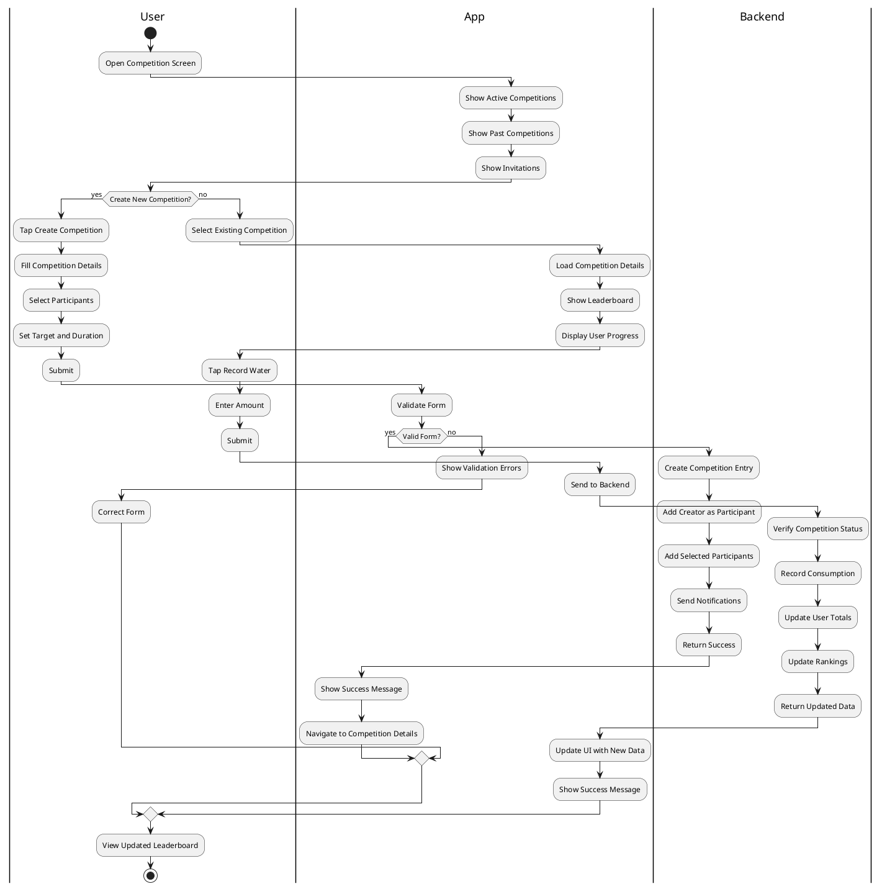

# Activity Diagram for Competition Creation and Participation

```plantuml
@startuml
|User|
start
:Open Competition Screen;

|App|
:Show Active Competitions;
:Show Past Competitions;
:Show Invitations;

|User|
if (Create New Competition?) then (yes)
  :Tap Create Competition;
  :Fill Competition Details;
  :Select Participants;
  :Set Target and Duration;
  :Submit;

  |App|
  :Validate Form;
  if (Valid Form?) then (yes)
    |Backend|
    :Create Competition Entry;
    :Add Creator as Participant;
    :Add Selected Participants;
    :Send Notifications;
    :Return Success;

    |App|
    :Show Success Message;
    :Navigate to Competition Details;
  else (no)
    |App|
    :Show Validation Errors;
    |User|
    :Correct Form;
  endif
else (no)
  :Select Existing Competition;

  |App|
  :Load Competition Details;
  :Show Leaderboard;
  :Display User Progress;

  |User|
  :Tap Record Water;
  :Enter Amount;
  :Submit;

  |App|
  :Send to Backend;

  |Backend|
  :Verify Competition Status;
  :Record Consumption;
  :Update User Totals;
  :Update Rankings;
  :Return Updated Data;

  |App|
  :Update UI with New Data;
  :Show Success Message;
endif

|User|
:View Updated Leaderboard;
stop
@enduml
```
