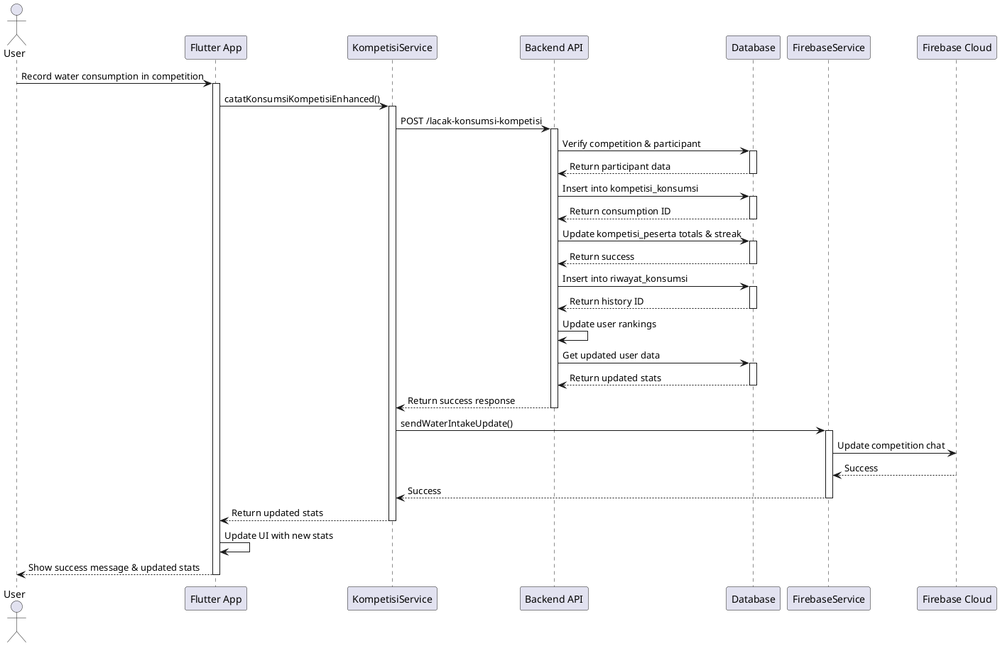

# Sequence Diagram for Competition Water Consumption Tracking

```plantuml
@startuml
actor User
participant "Flutter App" as App
participant "KompetisiService" as KService
participant "Backend API" as API
participant "Database" as DB
participant "FirebaseService" as Firebase
participant "Firebase Cloud" as Cloud

User -> App: Record water consumption in competition
activate App

App -> KService: catatKonsumsiKompetisiEnhanced()
activate KService

KService -> API: POST /lacak-konsumsi-kompetisi
activate API

API -> DB: Verify competition & participant
activate DB
DB --> API: Return participant data
deactivate DB

API -> DB: Insert into kompetisi_konsumsi
activate DB
DB --> API: Return consumption ID
deactivate DB

API -> DB: Update kompetisi_peserta totals & streak
activate DB
DB --> API: Return success
deactivate DB

API -> DB: Insert into riwayat_konsumsi
activate DB
DB --> API: Return history ID
deactivate DB

API -> API: Update user rankings

API -> DB: Get updated user data
activate DB
DB --> API: Return updated stats
deactivate DB

API --> KService: Return success response
deactivate API

KService -> Firebase: sendWaterIntakeUpdate()
activate Firebase
Firebase -> Cloud: Update competition chat
Cloud --> Firebase: Success
Firebase --> KService: Success
deactivate Firebase

KService --> App: Return updated stats
deactivate KService

App -> App: Update UI with new stats
App --> User: Show success message & updated stats
deactivate App

@enduml
```
