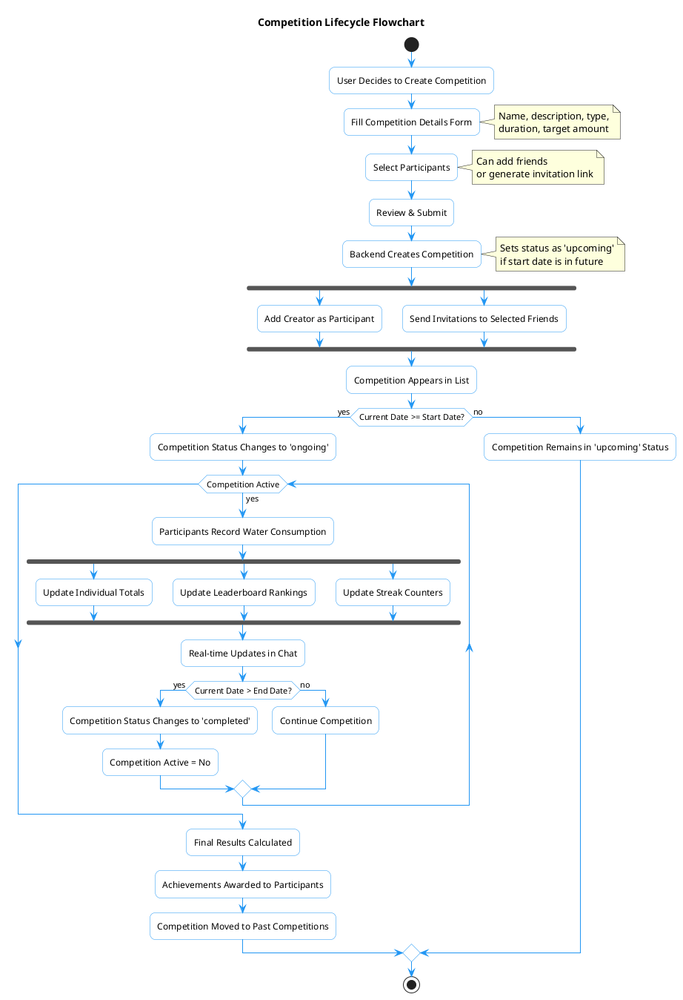

# Flowchart - Competition Lifecycle

```plantuml
@startuml
skinparam backgroundColor white
skinparam roundCorner 15
skinparam ArrowColor #2196F3
skinparam ActivityBorderColor #2196F3
skinparam ActivityBackgroundColor white

title Competition Lifecycle Flowchart

start

:User Decides to Create Competition;

:Fill Competition Details Form;
note right: Name, description, type,\nduration, target amount

:Select Participants;
note right: Can add friends\nor generate invitation link

:Review & Submit;

:Backend Creates Competition;
note right: Sets status as 'upcoming'\nif start date is in future

fork
  :Add Creator as Participant;
fork again
  :Send Invitations to Selected Friends;
end fork

:Competition Appears in List;

if (Current Date >= Start Date?) then (yes)
  :Competition Status Changes to 'ongoing';

  while (Competition Active) is (yes)
    :Participants Record Water Consumption;

    fork
      :Update Individual Totals;
    fork again
      :Update Leaderboard Rankings;
    fork again
      :Update Streak Counters;
    end fork

    :Real-time Updates in Chat;

    if (Current Date > End Date?) then (yes)
      :Competition Status Changes to 'completed';
      :Competition Active = No;
    else (no)
      :Continue Competition;
    endif
  endwhile

  :Final Results Calculated;

  :Achievements Awarded to Participants;

  :Competition Moved to Past Competitions;

else (no)
  :Competition Remains in 'upcoming' Status;
endif

stop
@enduml
```
