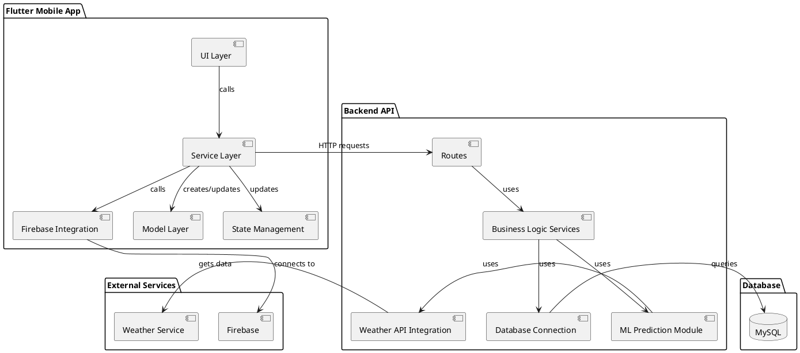

# Component Diagram

```plantuml
@startuml
skinparam componentStyle uml2

package "Flutter Mobile App" {
  [UI Layer] as UI
  [Service Layer] as Services
  [Model Layer] as Models
  [State Management] as State
  [Firebase Integration] as FlutterFirebase
}

package "Backend API" {
  [Routes] as Routes
  [Business Logic Services] as BLogic
  [Database Connection] as DBConnect
  [ML Prediction Module] as MLModule
  [Weather API Integration] as WeatherAPI
}

package "Database" {
  database "MySQL" as MySQL
}

package "External Services" {
  [Firebase] as FirebaseCloud
  [Weather Service] as WeatherService
}

UI -down-> Services : calls
Services -down-> Models : creates/updates
Services -down-> State : updates
Services -right-> Routes : HTTP requests
Services -down-> FlutterFirebase : calls
FlutterFirebase -right-> FirebaseCloud : connects to
Routes -down-> BLogic : uses
BLogic -down-> DBConnect : uses
DBConnect -right-> MySQL : queries
BLogic -down-> MLModule : uses
WeatherAPI -right-> WeatherService : gets data
MLModule -left-> WeatherAPI : uses

@enduml
```
