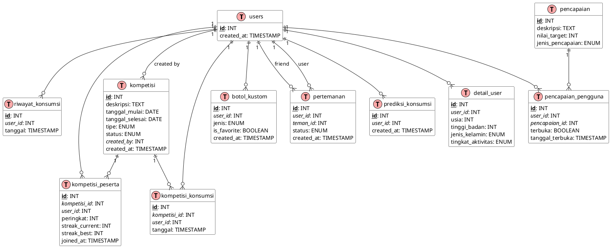

# Entity Relationship Diagram (ERD)

```plantuml
@startuml
!define table(x) class x << (T,#FFAAAA) >>
!define primary_key(x) <b><u>x</u></b>
!define foreign_key(x) <i>x</i>
hide methods
hide stereotypes

skinparam classAttributeIconSize 0
skinparam ClassBackgroundColor White
skinparam ClassBorderColor Black

table(users) {
  primary_key(id): INT
  nama: VARCHAR(255)
  email: VARCHAR(255)
  password: VARCHAR(255)
  created_at: TIMESTAMP
}

table(detail_user) {
  primary_key(id): INT
  foreign_key(user_id): INT
  usia: INT
  berat_badan: DECIMAL(5,2)
  tinggi_badan: INT
  jenis_kelamin: ENUM
  tingkat_aktivitas: ENUM
}

table(riwayat_konsumsi) {
  primary_key(id): INT
  foreign_key(user_id): INT
  jumlah: DECIMAL(5,2)
  tanggal: TIMESTAMP
}

table(pencapaian) {
  primary_key(id): INT
  judul: VARCHAR(255)
  deskripsi: TEXT
  nama_ikon: VARCHAR(100)
  nilai_target: INT
  jenis_pencapaian: ENUM
}

table(pencapaian_pengguna) {
  primary_key(id): INT
  foreign_key(user_id): INT
  foreign_key(pencapaian_id): INT
  progres: DECIMAL(5,4)
  terbuka: BOOLEAN
  tanggal_terbuka: TIMESTAMP
}

table(kompetisi) {
  primary_key(id): INT
  nama: VARCHAR(255)
  deskripsi: TEXT
  tanggal_mulai: DATE
  tanggal_selesai: DATE
  target_harian: DECIMAL(5,2)
  tipe: ENUM
  status: ENUM
  foreign_key(created_by): INT
  created_at: TIMESTAMP
}

table(kompetisi_peserta) {
  primary_key(id): INT
  foreign_key(kompetisi_id): INT
  foreign_key(user_id): INT
  total_konsumsi: DECIMAL(8,2)
  peringkat: INT
  streak_current: INT
  streak_best: INT
  joined_at: TIMESTAMP
}

table(kompetisi_konsumsi) {
  primary_key(id): INT
  foreign_key(kompetisi_id): INT
  foreign_key(user_id): INT
  jumlah: DECIMAL(5,2)
  tanggal: TIMESTAMP
}

table(botol_kustom) {
  primary_key(id): INT
  foreign_key(user_id): INT
  nama: VARCHAR(255)
  ukuran: DECIMAL(5,3)
  warna: VARCHAR(7)
  jenis: ENUM
  is_favorite: BOOLEAN
  created_at: TIMESTAMP
}

table(pertemanan) {
  primary_key(id): INT
  foreign_key(user_id): INT
  foreign_key(teman_id): INT
  status: ENUM
  created_at: TIMESTAMP
}

table(prediksi_konsumsi) {
  primary_key(id): INT
  foreign_key(user_id): INT
  rekomendasi_air: DECIMAL(5,2)
  tingkat_aktivitas: VARCHAR(50)
  suhu: DECIMAL(5,2)
  created_at: TIMESTAMP
}

users "1" ||--o{ detail_user
users "1" ||--o{ riwayat_konsumsi
users "1" ||--o{ botol_kustom
users "1" ||--o{ prediksi_konsumsi
users "1" ||--o{ kompetisi : created by
users "1" ||--o{ kompetisi_peserta
kompetisi "1" ||--o{ kompetisi_peserta
kompetisi "1" ||--o{ kompetisi_konsumsi
users "1" ||--o{ kompetisi_konsumsi
users "1" ||--o{ pencapaian_pengguna
pencapaian "1" ||--o{ pencapaian_pengguna
users "1" ||--o{ pertemanan : user
users "1" ||--o{ pertemanan : friend

@enduml
```
