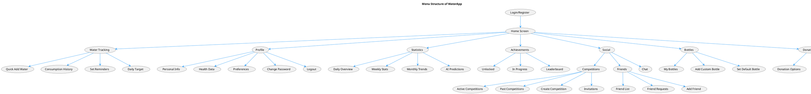

# Menu Structure Diagram

```plantuml
@startuml
skinparam backgroundColor white
skinparam roundCorner 15
skinparam ArrowColor #2196F3
skinparam ActorBorderColor #2196F3
skinparam ActorBackgroundColor white
skinparam ActivityBorderColor #2196F3
skinparam ActivityBackgroundColor white

title Menu Structure of WaterApp

(Login/Register) --> (Home Screen)

(Home Screen) --> (Water Tracking)
(Home Screen) --> (Profile)
(Home Screen) --> (Statistics)
(Home Screen) --> (Achievements)
(Home Screen) --> (Social)
(Home Screen) --> (Bottles)
(Home Screen) --> (Donation)

(Water Tracking) --> (Quick Add Water)
(Water Tracking) --> (Consumption History)
(Water Tracking) --> (Set Reminders)
(Water Tracking) --> (Daily Target)

(Profile) --> (Personal Info)
(Profile) --> (Health Data)
(Profile) --> (Preferences)
(Profile) --> (Change Password)
(Profile) --> (Logout)

(Statistics) --> (Daily Overview)
(Statistics) --> (Weekly Stats)
(Statistics) --> (Monthly Trends)
(Statistics) --> (AI Predictions)

(Achievements) --> (Unlocked)
(Achievements) --> (In Progress)
(Achievements) --> (Leaderboard)

(Social) --> (Competitions)
(Social) --> (Friends)
(Social) --> (Chat)

(Competitions) --> (Active Competitions)
(Competitions) --> (Past Competitions)
(Competitions) --> (Create Competition)
(Competitions) --> (Invitations)

(Friends) --> (Friend List)
(Friends) --> (Friend Requests)
(Friends) --> (Add Friend)

(Bottles) --> (My Bottles)
(Bottles) --> (Add Custom Bottle)
(Bottles) --> (Set Default Bottle)

(Donation) --> (Donation Options)
(Donation) --> (Donation History)
(Donation) --> (Impact Statistics)

@enduml
```
