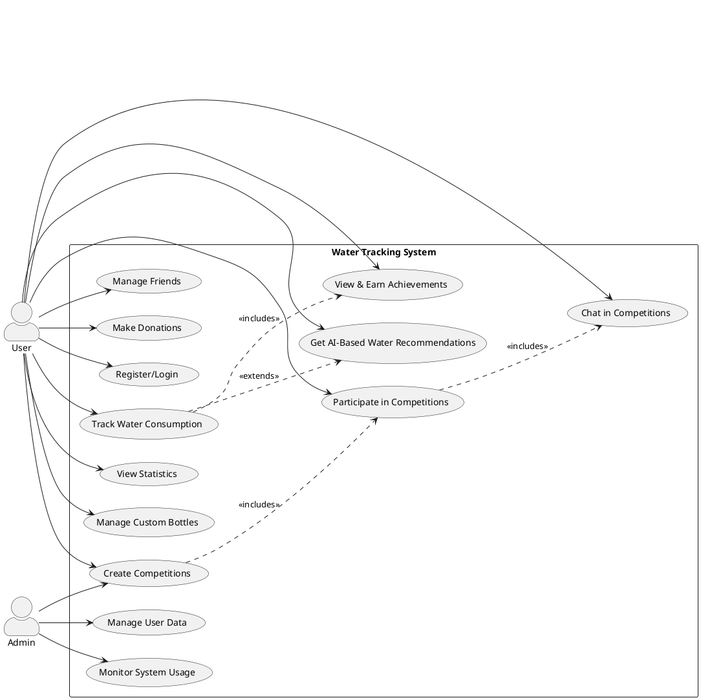

# Use Case Diagram for WaterApp

```plantuml
@startuml
skinparam actorStyle awesome
skinparam packageStyle rectangle

left to right direction

actor "User" as U
actor "Admin" as A

rectangle "Water Tracking System" {
  usecase "Register/Login" as UC1
  usecase "Track Water Consumption" as UC2
  usecase "View Statistics" as UC3
  usecase "Manage Custom Bottles" as UC4
  usecase "View & Earn Achievements" as UC5
  usecase "Participate in Competitions" as UC6
  usecase "Create Competitions" as UC7
  usecase "Manage Friends" as UC8
  usecase "Chat in Competitions" as UC9
  usecase "Get AI-Based Water Recommendations" as UC10
  usecase "Make Donations" as UC11
  usecase "Manage User Data" as UC12
  usecase "Monitor System Usage" as UC13
}

U --> UC1
U --> UC2
U --> UC3
U --> UC4
U --> UC5
U --> UC6
U --> UC7
U --> UC8
U --> UC9
U --> UC10
U --> UC11
A --> UC12
A --> UC13
A --> UC7

UC6 ..> UC9 : <<includes>>
UC2 ..> UC5 : <<includes>>
UC7 ..> UC6 : <<includes>>
UC2 ..> UC10 : <<extends>>

@enduml
```
