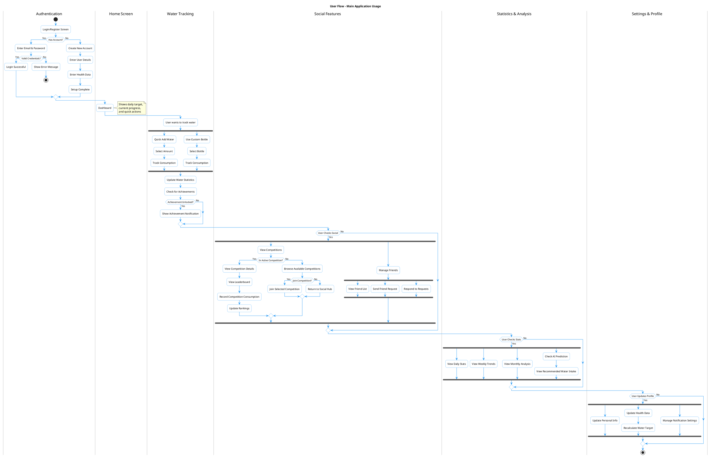

# User Flow Diagram

```plantuml
@startuml
skinparam backgroundColor white
skinparam roundCorner 15
skinparam ArrowColor #2196F3
skinparam ActivityBorderColor #2196F3
skinparam ActivityBackgroundColor white
skinparam swimlaneBorderColor #CCCCCC

title User Flow - Main Application Usage

|Authentication|
start
:Login/Register Screen;
if (Has Account?) then (Yes)
  :Enter Email & Password;
  if (Valid Credentials?) then (Yes)
    :Login Successful;
  else (No)
    :Show Error Message;
    stop
  endif
else (No)
  :Create New Account;
  :Enter User Details;
  :Enter Health Data;
  :Setup Complete;
endif

|Home Screen|
:Dashboard;
note right: Shows daily target,\ncurrent progress,\nand quick actions

|Water Tracking|
:User wants to track water;
fork
  :Quick Add Water;
  :Select Amount;
  :Track Consumption;
fork again
  :Use Custom Bottle;
  :Select Bottle;
  :Track Consumption;
end fork

:Update Water Statistics;
:Check for Achievements;
if (Achievement Unlocked?) then (Yes)
  :Show Achievement Notification;
else (No)
endif

|Social Features|
if (User Checks Social) then (Yes)
  fork
    :View Competitions;
    if (In Active Competition?) then (Yes)
      :View Competition Details;
      :View Leaderboard;
      :Record Competition Consumption;
      :Update Rankings;
    else (No)
      :Browse Available Competitions;
      if (Join Competition?) then (Yes)
        :Join Selected Competition;
      else (No)
        :Return to Social Hub;
      endif
    endif
  fork again
    :Manage Friends;
    fork
      :View Friend List;
    fork again
      :Send Friend Request;
    fork again
      :Respond to Requests;
    end fork
  end fork
else (No)
endif

|Statistics & Analysis|
if (User Checks Stats) then (Yes)
  fork
    :View Daily Stats;
  fork again
    :View Weekly Trends;
  fork again
    :View Monthly Analysis;
  fork again
    :Check AI Prediction;
    :View Recommended Water Intake;
  end fork
else (No)
endif

|Settings & Profile|
if (User Updates Profile) then (Yes)
  fork
    :Update Personal Info;
  fork again
    :Update Health Data;
    :Recalculate Water Target;
  fork again
    :Manage Notification Settings;
  end fork
else (No)
endif

stop

@enduml
```
