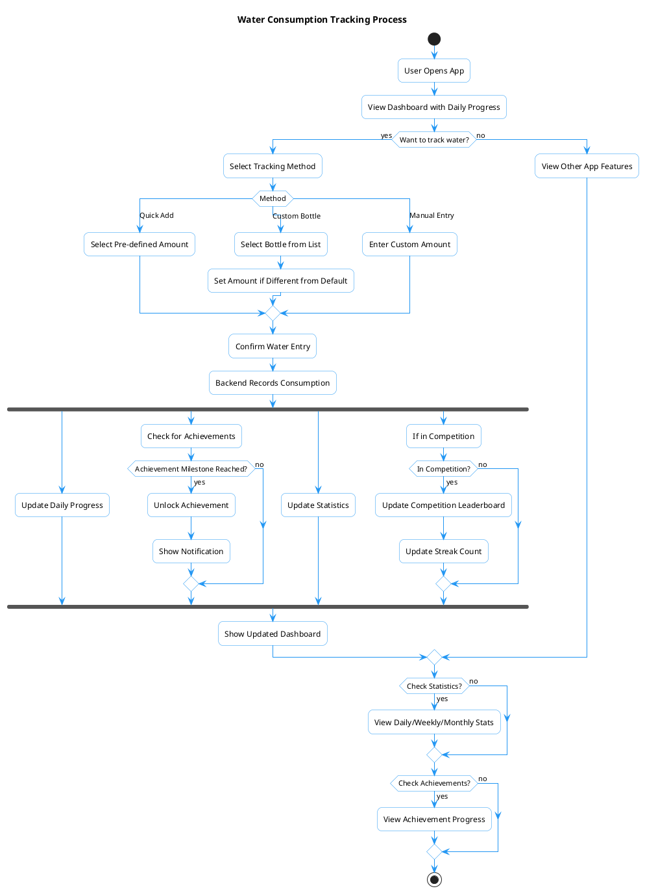

# Flowchart - Water Consumption Tracking Process

```plantuml
@startuml
skinparam backgroundColor white
skinparam roundCorner 15
skinparam ArrowColor #2196F3
skinparam ActivityBorderColor #2196F3
skinparam ActivityBackgroundColor white

title Water Consumption Tracking Process

start

:User Opens App;

:View Dashboard with Daily Progress;

if (Want to track water?) then (yes)
  :Select Tracking Method;

  switch (Method)
  case (Quick Add)
    :Select Pre-defined Amount;
  case (Custom Bottle)
    :Select Bottle from List;
    :Set Amount if Different from Default;
  case (Manual Entry)
    :Enter Custom Amount;
  endswitch

  :Confirm Water Entry;

  :Backend Records Consumption;

  fork
    :Update Daily Progress;
  fork again
    :Check for Achievements;
    if (Achievement Milestone Reached?) then (yes)
      :Unlock Achievement;
      :Show Notification;
    else (no)
    endif
  fork again
    :Update Statistics;
  fork again
    :If in Competition;
    if (In Competition?) then (yes)
      :Update Competition Leaderboard;
      :Update Streak Count;
    else (no)
    endif
  end fork

  :Show Updated Dashboard;

else (no)
  :View Other App Features;
endif

if (Check Statistics?) then (yes)
  :View Daily/Weekly/Monthly Stats;
else (no)
endif

if (Check Achievements?) then (yes)
  :View Achievement Progress;
else (no)
endif

stop
@enduml
```
